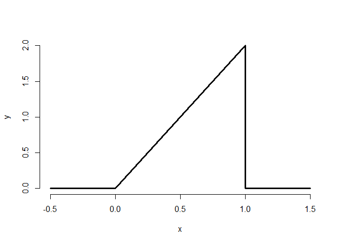

    x <- c(-0.5,0,1,1,1.5)
    y <- c(0,0,2,0,0)
    plot(x , y, lwd = 3 ,frame = F ,type = "l")

Recall That A Distribution must be valid
----------------------------------------

### 1. Non negative (A.K.A Above the horizontal axis everywhere)

### 2. Easy to get the are , i dont know what this mean ,i guess this mean easy to get the intervals

    # question Of Interest 
    # Now consider answering the following question. 
    # What is the probability that 75% or fewer ofcalls
    # get addressed?
    # Remember Triangle formula ?
    # 1/2 * height * length
    print( (1.5 * 0.75)/ 2)

    ## [1] 0.5625

    ?pbeta()

    ## starting httpd help server ... done

    # # If you want to use this function find the mode of  your distribution 
    # 
    # Mode <- function(x) {
    #   GetUnique <- unique(x)
    #   GetUnique[which.max(tabulate(match(x , x)))]
    # }
    # xvarmode = Mode(x = x)
    # print(xvarmode)
    # yvarmode = Mode(x = y)

    print(stats::pbeta(q = 0.75 , shape1 = 2 , shape2 = 1))

    ## [1] 0.5625

Exercises Solution :

1.  Can you add the probabilities of any two events to get the
    probability of at least one occurring? **Answer** : Nope , you need
    to substract it with the intersection, but if you want to add ,
    follow this thumb rule : P(AUB) = P(A) + P(B) - P(A$B)

2.  I define a PMF, p so that for x = 0 and x = 1 we have p(0) = -0:1
    and p(1) = 1.1. Is this a valid PMF? **Answer** :No ! Remember it’s
    probability value betweeen 0 - 1

3.  What is the probability that 75% or fewer calls get answered in a
    randomly sampled day from the population distribution from this
    chapter?

**Answer** :

    cat("So the Probability of 75% or fewer calls get answered is :",stats::pbeta(0.75 , shape1 = 2 , shape2 = 1))

    ## So the Probability of 75% or fewer calls get answered is : 0.5625

1.  The 97.5th percentile of a distribution is? **Answer** :

<!-- -->

    cat("So the Probability of 97.5% or fewer calls get answered is :" ,stats::qbeta(0.975 ,shape1 = 2, shape2= 1))

    ## So the Probability of 97.5% or fewer calls get answered is : 0.9874209

1.  Consider influenza epidemics for two parent heterosexual families.
    Suppose that the probability is 15% that at least one of the parents
    has contracted the disease. The probability that the father has
    contracted influenza is 10% while that the mother contracted the
    disease is 9%. Whatis the probability that both contracted influenza
    expressed as a whole number percentage? **Answer** : Suppose that
    disease is influenza A : father B : Mother P(AUB) :15% Mother or
    Father have the disease &lt;“At least” is the key&gt; P(A) : 10% or
    P(Ac) = 90% P(B) : 9% or p(Bc) = 91% P(A$B) : is going to be both
    mother and father have the disease

<!-- -->

    cat("So there are : " ,0.10 + 0.09 - 0.15 ,"Chance both parent have the disease")

    ## So there are :  0.04 Chance both parent have the disease

    cat("And :" , 0.9 + 0.91 - 0.85 , "Chance both parent haven't the diseaese")

    ## And : 0.96 Chance both parent haven't the diseaese

1.  A random variable,X, is uniform, a box from 0 to 1 of height 1. (So
    that it’s density is f(x) = 1 for 0 &lt;= x &lt;= 1.) What is it’s
    median expressed to two decimal places? . **Answer**

<!-- -->

    x <- stats::runif(1000)
    cat("The mEdian Is obvio " , stats::punif(0.5 , min = 0 ,max= 1))

    ## The mEdian Is obvio  0.5

1.  If a continuous density that never touches the horizontal axis is
    symmetric about zero, can we say that its associated median is zero?
    yeah,
